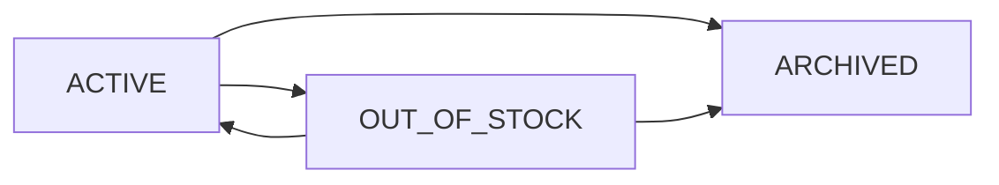

# Inventory Foundation Architecture

Sprint 4 establishes the Inventory and Warehouse Foundation for Prontera Commerce. The design is Merchant OS first, audit-oriented, and prepared for future POS, order allocation, compliance, and accounting workflows.

## Inventory Lifecycle

Inventory is tracked at the warehouse and product variant level.

Computed quantity:

`quantityAvailable = quantityOnHand - quantityReserved`

Inventory items are soft deleted by archiving, while movements and adjustments remain immutable.

## Warehouse Model

`Warehouse` represents a physical or operational stock location for a shop.

Fields:

- `shopId`
- `name`
- `code`
- `address`
- `countryCode`
- `timeZone`
- `status`

Rules:

- Warehouse belongs to one shop.
- Warehouse code is unique per active shop.
- Warehouse deletion is soft delete only.
- Country and timezone values align with the Global Commerce Foundation.

## Inventory Item Model

`InventoryItem` connects a warehouse to a product variant.

Fields:

- `warehouseId`
- `productVariantId`
- `sku`
- `quantityOnHand`
- `quantityReserved`
- `reorderPoint`
- `reorderQuantity`
- `status`

This sprint does not implement variant option management or inventory location transfers beyond audit movement types.

## Movement Model

`InventoryMovement` is the immutable audit log for stock changes.

Movement types:

- `INBOUND`
- `OUTBOUND`
- `TRANSFER_IN`
- `TRANSFER_OUT`
- `ADJUSTMENT`
- `RESERVATION`
- `RELEASE`

Movements store:

- Inventory item
- Movement type
- Quantity
- Reference number
- Notes
- User who performed the action
- Creation timestamp

Movements are never deleted.

## Adjustment Model

`InventoryAdjustment` records manual stock corrections.

Reasons:

- `COUNT_CORRECTION`
- `DAMAGED`
- `LOST`
- `EXPIRED`
- `MANUAL`

Adjustments record before and after quantity and create paired movement records for auditability.

## Reservation Model

`InventoryReservation` reserves stock for future order allocation.

Statuses:

- `ACTIVE`
- `RELEASED`
- `EXPIRED`

Orders are intentionally out of scope. Reservations prepare the system for future allocation without implementing checkout.

## Alert Model

`InventoryAlert` records operational stock signals.

Alert types:

- `LOW_STOCK`
- `OUT_OF_STOCK`

Statuses:

- `OPEN`
- `RESOLVED`

Alerts are created when available inventory reaches zero or falls to the item reorder point.

## Audit Strategy

All stock-changing operations create audit records.

- Inventory movements are append-only.
- Inventory adjustments store before and after quantities.
- Reservations create reservation movement records.
- Acting users are stored through `performedBy`.
- Audit records support future compliance, accounting, and operational review.

## Permission Model

Inventory permissions use the existing shop staff model.

- `OWNER` and `MANAGER` can manage warehouses, items, movements, adjustments, reservations, and alerts.
- `CASHIER` can view inventory and create outbound movement records.
- `STAFF` can read inventory only.

## Future POS Integration

Future POS will consume this foundation by:

- Creating `OUTBOUND` movements for completed sales.
- Creating and releasing reservations during checkout.
- Reading available quantity before sale confirmation.
- Recording user and terminal context in movement references.

Sprint 4 does not implement POS, orders, payments, checkout, marketplace search, AI agents, avatars, guilds, or virtual world systems.
