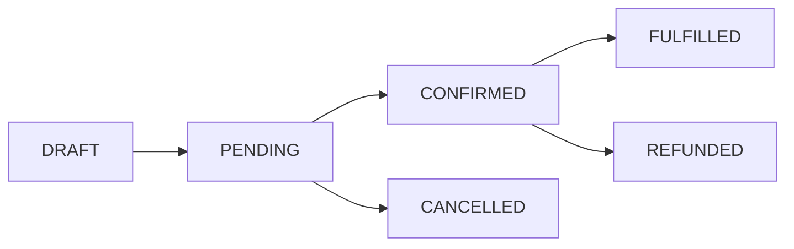

# Order Lifecycle Architecture

Sprint 5 establishes the first revenue-generating transaction layer for Prontera Commerce. It connects carts, checkout, orders, manual payment records, POS sessions, and inventory audit records.

## Order Flow

Order statuses:

- `DRAFT`
- `PENDING`
- `CONFIRMED`
- `FULFILLED`
- `CANCELLED`
- `REFUNDED`

Order items snapshot product and variant details at order time so historical sales remain stable even when catalog data changes.

## Checkout Flow

Checkout begins from the active cart.

1. Validate the authenticated user can transact for the shop.
2. Load active cart items.
3. Validate available inventory for each variant.
4. Create inventory reservations.
5. Record reservation movements.
6. Create a pending order.
7. Create order items and a manual payment record.
8. Mark the cart as checkout.

Confirmation converts reservations into outbound stock movements and marks the order confirmed.

Cancellation releases reservations and marks the order cancelled.

## Inventory Interaction

Checkout uses Sprint 4 inventory foundations:

- Reservations increase `quantityReserved`.
- Confirmation decreases `quantityOnHand` and `quantityReserved`.
- Cancellation decreases `quantityReserved`.
- Every stock operation writes an immutable movement record.

This preserves an audit trail for future compliance and accounting.

## Payment Record Strategy

Sprint 5 stores manual payment records only.

Supported methods:

- `CASH`
- `BANK_TRANSFER`
- `PROMPTPAY`
- `MANUAL`

Payment gateways are intentionally out of scope. Future gateway integrations should attach provider references to payment records without replacing the order lifecycle.

## POS Flow

POS sessions model cashier operating periods.

1. Cashier opens a POS session with opening cash.
2. System creates an initial shift.
3. Cashier creates orders through the transaction layer.
4. Cashier closes the session with closing cash.
5. Open shifts close with the session.

## Boundaries

Sprint 5 does not implement:

- Stripe
- PayPal
- Omise
- Payment gateway processing
- Marketplace search
- AI agents
- Avatar systems
- Virtual town systems
