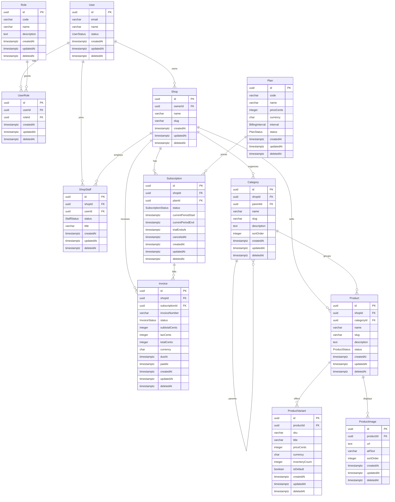

# Prontera Commerce ERD v1

Sprint 0.5 establishes the first production database foundation for identity, billing, merchant, and catalog domains.

## Domain Boundaries

- **Identity:** `User`, `Role`, `UserRole`
- **Billing:** `Plan`, `Subscription`, `Invoice`
- **Merchant:** `Shop`, `ShopStaff`
- **Catalog:** `Category`, `Product`, `ProductVariant`, `ProductImage`

## Entity Relationship Diagram

## PostgreSQL Notes

- Primary keys use UUID columns with `gen_random_uuid()` database defaults.
- Soft delete is represented by nullable `deletedAt` on all domain tables.
- Active-record uniqueness is enforced with partial unique indexes in the migration, for example active shop slugs and active product slugs per shop.
- Tenant-sensitive catalog data is scoped by `shopId`.
- Common query paths are indexed by tenant, status, parent/category, billing period, and soft-delete markers.
